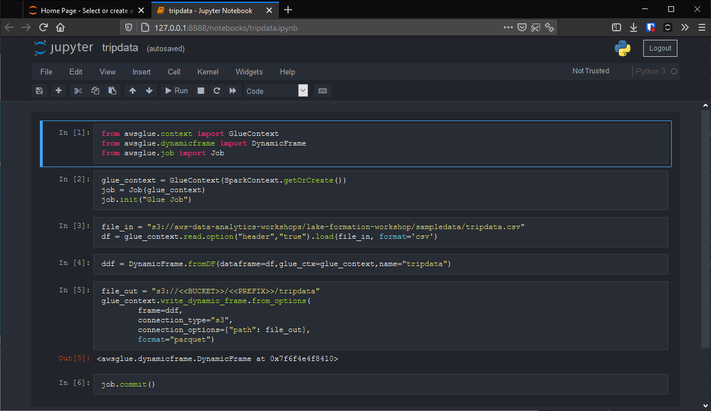

# Spark for Glue development

## Build

Utilize os argumentos de build (`--build-arg`) para determinar as versões dos serviços que serão utilizados:

+ [MAVEN_REPO](http://maven.apache.org)
+ [SPARK_REPO](https://spark.apache.org)
+ [GLUE_REPO](https://docs.aws.amazon.com/glue/latest/dg/aws-glue-api-jobs-job.html)
+ [AVRO_REPO](http://avro.apache.org)

> Estes argumentos são opcionais, o build utilizará os parametros padrão caso nenhum valor seja valor informado

```sh
docker image build \
    --build-arg MAVEN_REPO="https://aws-glue-etl-artifacts.s3.amazonaws.com/glue-common/apache-maven-3.6.0-bin.tar.gz"\
    --build-arg SPARK_REPO="https://aws-glue-etl-artifacts.s3.amazonaws.com/glue-1.0/spark-2.4.3-bin-hadoop2.8.tgz"\
    --build-arg GLUE_REPO="https://github.com/awslabs/aws-glue-libs/archive/glue-1.0.zip"\
    --build-arg AVRO_REPO="https://repo1.maven.org/maven2/org/apache/spark/spark-avro_2.11/2.4.0/spark-avro_2.11-2.4.0.jar"\
    --build-arg AWS_REGION="us-east-1" -t spark-glue .
```

## Run

As conexões aos serviços aws são feitos através da **Access Key** e **Secret Key** do usuário *IAM* que deverão ser passadas para o container como variáveis de ambiente (`AWS_ACCESS_KEY_ID` e `AWS_SECRET_ACCESS_KEY`)

```sh
docker run -v $(pwd)/notebooks:/tmp/notebooks \
    -e "AWS_ACCESS_KEY_ID=XXXXXXXXXXXXXX" \
    -e "AWS_SECRET_ACCESS_KEY=XXXXXXXXXXXXXXXXXXXXXXXXXXXX" \
    -e "AWS_DEFAULT_REGION=us-east-1"\
    -p 8888:8888 -p 4040:4040 spark-glue
```

Ao final da execução da imagem, seu console terá o endereço e *token* de autenticação do **Jupyter Notebook**

```log
[I 14:33:42.465 NotebookApp] Serving notebooks from local directory: /root
[I 14:33:42.465 NotebookApp] Jupyter Notebook 6.1.3 is running at:
[I 14:33:42.465 NotebookApp] http://9824aeb26261:8888/?token=6e1b84b3519bf699313ea05182dc038238f12e67c745d2fb
[I 14:33:42.465 NotebookApp]  or http://127.0.0.1:8888/?token=6e1b84b3519bf699313ea05182dc038238f12e67c745d2fb
[I 14:33:42.465 NotebookApp] Use Control-C to stop this server and shut down all kernels (twice to skip confirmation).
[W 14:33:42.488 NotebookApp] No web browser found: could not locate runnable browser.
[C 14:33:42.489 NotebookApp]

    To access the notebook, open this file in a browser:
        file:///root/.local/share/jupyter/runtime/nbserver-1-open.html
    Or copy and paste one of these URLs:
        http://9824aeb26261:8888/?token=6e1b84b3519bf699313ea05182dc038238f12e67c745d2fb
     or http://127.0.0.1:8888/?token=6e1b84b3519bf699313ea05182dc038238f12e67c745d2fb
```



### Portas

+ Jupyter Notebook: `8888`
+ Console Spark: `4040`